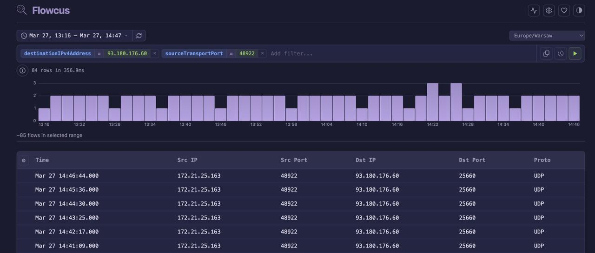

# Flowcus

High-performance NetFlow/IPFIX flow collector with columnar storage and built-in query engine. Single binary, zero external dependencies.



Collects NetFlow (RFC 3954) v5/v9 and IPFIX (RFC 7011) over UDP/TCP, stores flows in a compressed columnar format with automatic compaction, and serves a web UI for real-time analysis.

## Features

- **NetFlow v5/v9 + IPFIX collection** — UDP and TCP listeners, 200+ IANA IEs + 9 vendor registries (Cisco, Juniper, Palo Alto, VMware, Fortinet, ntop, Nokia, Huawei, Barracuda)
- **Columnar storage** — Time-partitioned, generation-based merge compaction, automatic codec selection (Delta, DeltaDelta, GCD), CRC32-C integrity on all formats, ZSTD compressed
- **Query engine** — FQL query language with typed AST, bloom filter point lookups, granule mark seeking
- **Embedded web UI** — React frontend compiled into the binary, no separate web server needed
- **Single binary** — All components embedded, deploy by copying one file

## Quick Start

```bash
# Run with defaults (HTTP :2137, IPFIX :4739/udp)
./flowcus

# Or with Docker
docker run -p 2137:2137 -p 4739:4739/udp ghcr.io/consi/flowcus:latest
```

Open `http://localhost:2137` for the web UI.

#### MikroTik RouterOS Configuration Example

```routeros
/ip traffic-flow
set cache-entries=1k enabled=yes interfaces=ether1-wan
/ip traffic-flow ipfix
set nat-events=yes
/ip traffic-flow target
add dst-address=192.168.1.100 port=4739 src-address=192.168.1.1 version=ipfix
```

Replace `192.168.1.100` with your Flowcus server IP, `192.168.1.1` with the router's address, and `ether1-wan` with your WAN interface name.

## Installation

**Binary** — download from [Releases](https://github.com/consi/flowcus/releases)

**Debian/Ubuntu:**
```bash
sudo dpkg -i flowcus_*.deb
sudo systemctl enable --now flowcus
```

**Docker:**
```bash
docker run -d \
  -p 2137:2137 \
  -p 4739:4739/udp \
  -v flowcus-data:/data/storage \
  ghcr.io/consi/flowcus:latest
```

## Configuration

Settings file at `{storage_dir}/flowcus.settings` (auto-created on first run):

```toml
[logging]
format = "human"              # or "json"

[server]
host = "0.0.0.0"
port = 2137

[ipfix]
port = 4739
udp = true
tcp = false

[storage]
dir = "storage"
retention_hours = 744         # 31 days, 0 = unlimited
merge_workers = 4
flush_interval_secs = 5
```

All settings are overridable via CLI flags or environment variables:

```bash
flowcus --port 8080 --storage /var/lib/flowcus
flowcus --settings /etc/flowcus.settings
flowcus --log-format json

# Environment variables
FLOWCUS_PORT=8080 FLOWCUS_STORAGE=/var/lib/flowcus flowcus
```

## Development

Requires: Rust 1.85+, Node 22+, [just](https://github.com/casey/just)

```bash
just dev            # Full stack (Vite HMR + Rust backend)
just test           # Unit + integration + E2E tests
just build          # Production release build
just check          # Format + lint + test
```

## License

[Apache-2.0](LICENSE)
